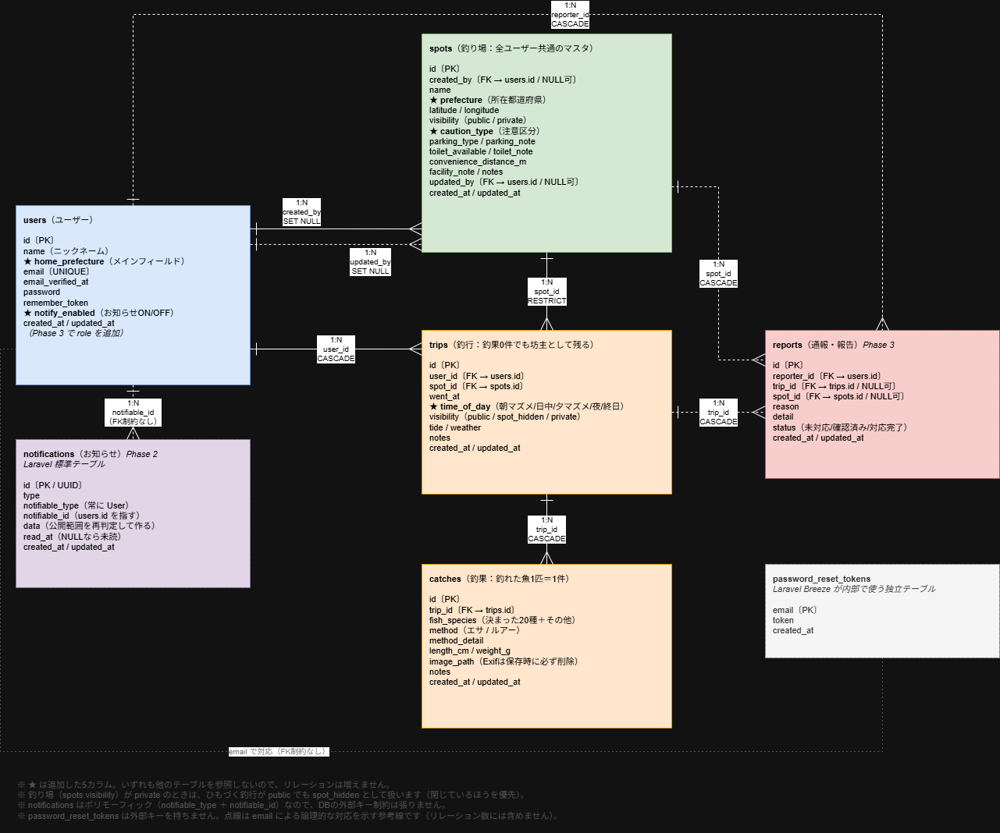

# FishingLog（釣果記録・釣り場情報共有アプリ）

釣行を記録していくと、「どの潮・時間帯・釣り方なら、何回行って何回釣れたか」が貯まっていき、次にどこへ行くかを決める材料になる Web アプリです。
月に1〜3回ほど釣りに行く人が、自分の記録とみんなの公開記録から「釣れる条件」を見つけることを目指しています。

- 主役は **釣行プランナー**（行く日と県を選ぶと、過去の記録から釣り場を提案）と **釣り場カルテ**（その釣り場で、選んだ日の条件のときにどうだったか）
- スクールに提出する個人開発アプリです。定義書は [`docs/spec.md`](docs/spec.md)、定義書と違うことをしたときの判断と理由は [`docs/decisions.md`](docs/decisions.md) にすべて記録しています

## 開発者・リンク

| 項目 | 内容 |
| --- | --- |
| 開発者 | kazuyuki-a-dev（[GitHub](https://github.com/kazuyuki-a-dev)） |
| リポジトリ | https://github.com/kazuyuki-a-dev/fishing-log |
| Issue | https://github.com/kazuyuki-a-dev/fishing-log/issues?q=is%3Aissue |
| Pull Request | https://github.com/kazuyuki-a-dev/fishing-log/pulls?q=is%3Apr |

## 主な機能

番号は定義書（`docs/spec.md`）の機能番号です。

### 記録する

| 番号 | 機能 | 内容 |
| --- | --- | --- |
| FN-01 | 釣り場・釣行・釣果の登録 | 釣り場・釣行・釣れた魚を登録・編集・削除。昔の釣行をまとめて登録する画面もある |
| FN-08 | 写真から自動で入力 | 写真の撮影日時と位置から、日時と近くの釣り場を候補に出す。潮は旧暦から計算し、天気は Open-Meteo から取得 |
| FN-15 | 釣り方の記録 | 魚1匹ごとに、エサかルアーかと、その詳しい内容を記録 |
| FN-07 | 釣果ハイライト | 登録した直後に「自分の最大サイズを更新！」「初めて釣った魚」「この釣り場で初めて釣れました！」などを知らせる |
| FN-14 | 現地の情報 | 注意区分・駐車場・トイレ・コンビニまでの距離。登録の直後に、まだ空いている項目を1〜2問だけ聞く |

### 行く前に決める（主役）

| 番号 | 機能 | 内容 |
| --- | --- | --- |
| FN-16 | 釣行プランナー | 行く日と県を選ぶと、その日の潮と過去の記録から釣り場を順に並べる。釣れた記録がなければ「ぴったり一致 → 潮だけ一致 → 月だけ一致」と条件をゆるめ、どのレベルの一致かを必ず表示する |
| FN-09 | 釣り場カルテ | 釣り場ごとの実績・最大サイズ・月×魚種の小さな表・釣行の履歴・現地の情報 |
| FN-11 | 釣行判断ビュー | カルテの一番上で、選んだ日の条件のときに「何回行って何回釣れたか」と、そのときの釣り方・魚を表示する |

### ふり返る・続ける

| 番号 | 機能 | 内容 |
| --- | --- | --- |
| FN-06 | ダッシュボード | 累計の釣果・魚種の数・釣行した日数・最大サイズ。記録が1件でも数字が動く |
| FN-10 | 継続カウンタと気づきカード | 今月の釣行回数・連続で記録している月数（スタンプ）・去年の同じ月との比較。釣行3件目からは「大潮のときに釣れているようです」などの気づきを、何件の記録から言っているかと一緒に出す |
| FN-02 | シーズンヒートマップ | 県ごとに、月×魚種の釣れた数を色の濃さで表示。「自分」と「みんな」を切り替えられる |
| FN-03 | 条件検索 | 釣り場・魚種・期間・潮・天候・時間帯・釣り方で絞り込み、「この条件で N回行って M回釣れた」をまとめて出す |
| FN-04 | CSV 出力 | 今の絞り込みのまま、自分のデータだけを CSV で保存（Excel で開いても文字化けしない） |

### みんなと共有する

| 番号 | 機能 | 内容 |
| --- | --- | --- |
| FN-12 | 公開範囲（3段階） | 全体公開／釣り場だけ隠す／非公開（初期値） |
| FN-13 | 釣果フィード | みんなの公開釣果を新しい順に。ログインしていなくても見られる |
| FN-17 | メインフィールド | 住んでいる県を設定すると、フィードやプランナーが最初からその県になる |
| FN-18 | 県内新着のお知らせ | 同じ県で釣果や釣り場が公開されると、ベルマークでお知らせ |
| NF-04 | 報告と管理画面 | 不適切な公開投稿を報告でき、管理者が対応状況を変えたり非表示にしたりできる |
| FN-05 | アカウント | 会員登録・ログイン・プロフィール・退会（Laravel Breeze） |

## 公開範囲とプライバシーの工夫

釣り場の場所は、釣り人にとって大事な情報です。見せてはいけないものが漏れないように、次のことを決めて、どの機能でも守っています。

- **公開範囲は3段階**：全体公開／釣り場だけ隠す／非公開。初期値は非公開
- **閉じているほうを優先**：釣り場が非公開なら、釣行が「全体公開」でも「釣り場だけ隠す」として扱う
- **サーバー側で取り除く**：「釣り場だけ隠す」の釣り場名と位置は、画面で隠すのではなく、サーバーで取り除いてから画面に渡す（通信の中身を見ても分からないように）
- **位置は約1km四方**：公開する釣り場の位置は、緯度・経度を小数第2位で切り捨てて表示する。正確な位置は登録した本人だけ
- **写真の位置情報を消す**：写真は保存するときに描き直して、Exif（撮影日時や位置の情報）を必ず消す
- **画面以外でも同じチェック**：お知らせ・CSV・釣り場の提案など、データが外に出るところすべてで公開範囲を確かめる。お知らせは番号だけを保存し、表示するたびにその時点の公開範囲で文章を作る（あとで非公開に戻しても、釣り場名が残らない）
- **テストで確かめる**：公開範囲は「3通り × 見る人3通り × 出る場所いくつも」と組み合わせが多いので、目で見るだけでは見落とす。Feature テストで自動的に確かめている

## 見た目のこだわり

テーマは **クレヨンのメモ帳風** です。3つの見本（釣りノート風・クレヨンのメモ帳風・海図風）を作って見比べて決めました。

- クレヨンの線は、画像を使わずに SVG フィルター（細かいノイズで線をゆらす）で描いている
- カルテは付箋と書き込み、ダッシュボードはノートの表とハンコのスタンプ
- **読みやすさを優先**：クレヨンの効果は枠や下線の飾りにだけかけ、文字・数字・表の線にはかけない。本文と数字は読みやすい BIZ UDPゴシック、見出しやボタンは手書きの字（Yomogi）。色は文字とのコントラストを計算して、目安（4.5）を超えるように決めた
- スマホ（幅 360px）でもくずれないように作っている

## 使った技術

| 種類 | 使ったもの |
| --- | --- |
| サーバー | PHP 8.5 / Laravel 13 / MySQL 8.4 |
| 画面 | Laravel Breeze（Blade）/ Alpine.js / Tailwind CSS v3 / Vite |
| 開発環境 | WSL2（Ubuntu）＋ Docker ＋ Laravel Sail |
| 写真 | Intervention Image v4（保存するときに描き直して Exif を消す）、ExifReader（ブラウザで撮影日時と位置を読む）、heic-to（iPhone の HEIC を JPEG に変換） |
| 地図 | Leaflet ＋ OpenStreetMap |
| 天気 | Open-Meteo（API キー不要） |
| フォント | Google Fonts の BIZ UDPGothic・Yomogi（どちらも SIL Open Font License） |

## データベース（ER 図）

アプリで使うテーブルは7つです（users・spots・trips・catches・reports・notifications・password_reset_tokens）。ほかに、Laravel が最初から作るセッション・キャッシュ・ジョブ用のテーブルがあります。各テーブルの列の説明は、定義書（`docs/spec.md`）のテーブル一覧にあります。

<details>
<summary>ER 図を開く</summary>



- 図は設計のとき（2026-09-25）に作ったものです。そのあと、次のことを変えています
  - `users.role` を足した（一般／管理者。図では「Phase 3 で role を追加」のメモ）
  - `trips.notified_at`・`spots.notified_at` を足した（県内新着のお知らせを送ったかの印）
  - `notifications.data` の中身：図では「公開範囲を再判定して作る」だが、実際は釣行・釣り場の番号だけを保存し、表示するたびにその時点の公開範囲をチェックして文章を作る（あとで非公開に戻しても、釣り場名が残らないように）
- ★ はあとから足した列、点線は外部キーの制約を張っていない（論理的な）つながりです

</details>

## セットアップ

Docker が使える環境（WSL2 など）を前提にしています。

```bash
git clone https://github.com/kazuyuki-a-dev/fishing-log.git
cd fishing-log

# PHP のパッケージを入れる（Sail を使えるようにするため、最初の1回だけ Docker で入れる）
docker run --rm -u "$(id -u):$(id -g)" -v "$(pwd):/var/www/html" -w /var/www/html \
    laravelsail/php84-composer:latest composer install --ignore-platform-reqs

cp .env.example .env

./vendor/bin/sail up -d
./vendor/bin/sail artisan key:generate
./vendor/bin/sail artisan migrate --seed
./vendor/bin/sail artisan storage:link
./vendor/bin/sail npm install
./vendor/bin/sail npm run build
```

ブラウザで http://localhost を開きます。

以下では、`./vendor/bin/sail` を `sail` と書いています（`alias sail='./vendor/bin/sail'` を設定すると短く打てます）。

### 気をつけること

- **`.env` の `APP_URL` は `http://localhost` のままにする**。`http://localhost:8000` にすると写真が表示されません
- **`sail down -v` は使わない**。データベースが消えます。止めるときは `sail stop`
- `sail artisan migrate:fresh --seed` は今のデータを全部消します。打つ前にバックアップ（下の「バックアップ」）を取ってください

## 開発用のログイン

シーダー（`database/seeders/DatabaseSeeder.php`）で、次のアカウントとデータが入ります。パスワードはすべて `password` です。

| メールアドレス | 内容 |
| --- | --- |
| `test@example.com` | 秋田県。釣行15件（いちばん画面を確かめやすい） |
| `minato@example.com`・`surf@example.com`・`iso@example.com` | 秋田県のほかの釣り人 |
| `wanoku@example.com` | 神奈川県（県の切り替えを確かめる用） |
| `admin@example.com` | 管理者（報告の管理画面 `/admin/reports` に入れる） |

- 秋田県に釣り場8件・釣行50件、神奈川県に釣り場2件・釣行6件。公開範囲は3段階を混ぜてあり、一部は坊主（釣果0件）
- 毎回同じデータになるように、乱数を固定しています
- 今いる人を管理者にするときは `sail artisan app:make-admin メールアドレス`（画面からは管理者になれません）

## テスト

```bash
sail artisan test
```

- 263 件（公開範囲とアクセス制御を中心に、各機能の計算や入力チェックも）
- テストでは外の API に本当にはつながない（天気は偽の返事を使う）

## バックアップ

データベースと写真のバックアップは `scripts/backup.sh`、戻すときは `scripts/restore.sh` を使います。くわしくは [`docs/backup.md`](docs/backup.md) を見てください。

## 開発の記録

- **定義書**：[`docs/spec.md`](docs/spec.md)（機能・画面・テーブルの一覧）
- **決めたことの記録**：[`docs/decisions.md`](docs/decisions.md)（定義書に書いていないことや、定義書と違うことをしたときの判断と理由を、日付つきですべて記録）
- **Issue と Pull Request**：機能ごとに Issue を立て、ブランチで作り、Pull Request でマージしています。コミットは「機能 → テスト → 記録」の順です
- 開発は3つのフェーズに分けて進めました
  - フェーズ1：記録する・カルテ・プランナー・公開範囲など、使い始めに必要なもの
  - フェーズ2：お知らせ・ヒートマップ・条件をゆるめて探す処理など、記録が貯まってから効くもの
  - フェーズ3：条件検索・CSV 出力・継続カウンタ・報告と管理画面・見た目
